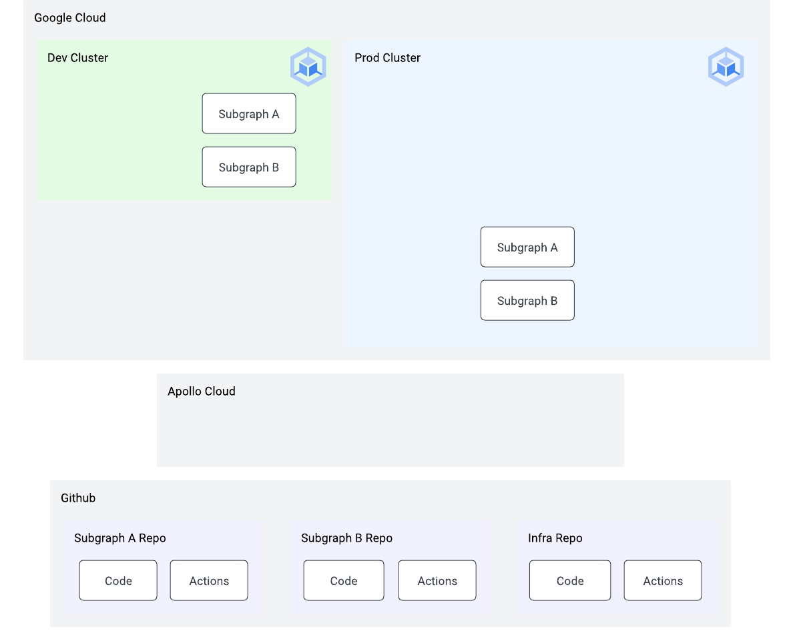

# 01 - Setup

⏱ Estimated time: 45 minutes

## What you'll build



## Part A: Gather accounts and credentials

### Clone this repo

```
git clone https://github.com/apollosolutions/build-a-supergraph.git
cd build-a-supergraph
```

### Install dependencies

- [GCloud CLI](https://cloud.google.com/sdk/docs/install)
- [Terraform](https://learn.hashicorp.com/tutorials/terraform/install-cli)
- [kubectl](https://kubernetes.io/docs/tasks/tools/)
- [kubectx](https://github.com/ahmetb/kubectx#installation)
- [Github CLI](https://cli.github.com/)
- [jq](https://stedolan.github.io/jq/download/)
- Optional: [Helm](https://helm.sh/docs/intro/install/)

### Gather accounts

- [Github](https://github.com/signup)
- [Apollo Studio](https://studio.apollographql.com/signup?referrer=build-a-supergraph)
- [Google Cloud](https://console.cloud.google.com/freetrial)
  - Must have a project [with billing enabled](https://cloud.google.com/resource-manager/docs/creating-managing-projects#gcloud)

### Gather credentials

- Google Cloud project id
- [Github personal access token](https://docs.github.com/en/authentication/keeping-your-account-and-data-secure/creating-a-personal-access-token)
  - [Settings > Developer Settings > Personal Access Tokens](https://github.com/settings/tokens)
  - Grant it permissions to the following scopes:
    - `repo` (for creating repos)
    - `delete_repo` (for cleanup at the end)
- [Apollo Studio Personal API key](https://studio.apollographql.com/user-settings/api-keys)

### Export all necessary variables

Make a copy of `.env.sample` called `.env` to keep track of these values. You can always run `source .env` to reload all environment variables in a new terminal session.

```sh
cd 01-setup/
cp .env.sample .env
```

Edit the new `.env` file:

```sh
export PROJECT_ID="<your google cloud project id>"
export APOLLO_KEY="<your apollo personal api key>"
export GITHUB_ORG="<your github org>"
export TF_VAR_github_token="<your github personal access token>"
```

Run this script to create your graph and get environment variables for Studio:

```sh
cd 01-setup
source .env
./create_graph.sh
```

The script adds a couple more environment variables to `.env`, so reload your environment now:

```sh
source .env
```

### Run setup commands

```sh
gcloud components update
gcloud components install gke-gcloud-auth-plugin
gcloud auth application-default login

gcloud config set project ${PROJECT_ID}
gcloud services enable \
  container.googleapis.com \
  secretmanager.googleapis.com \
  cloudasset.googleapis.com \
  storage.googleapis.com
```

```
gh auth login
```

<details>
  <summary>Optional: how do I specify a different name for clusters and repos? (The default is "apollo-supergraph-k8s".)</summary>

Before running `create_graph.sh`, `setup_clusters.sh`, or `terraform apply` export the prefix as as environment variables:

```sh
export CLUSTER_PREFIX=my-custom-prefix
export TF_VAR_demo_name=$CLUSTER_PREFIX
```

</details>

## Part B: Provision resources

<details>
  <summary>Have you run this tutorial before?</summary>

You may need to clean up your Github packages before creating new repos of the same name. Visit `https://github.com/<your github username>?tab=packages` and delete the packages created by the previous versions of the repos.

</details>

### Create Kubernetes clusters, basic infrastructure, and Github repositories

**Note: The following commands will create resources on your GCP account, and begin to accrue a cost.** The example infrastructure defaults to a lower-cost environment (small node count and instance size), however it will not be covered by GCP's free tier.

```sh
cd 01-setup
terraform init # takes about 2 minutes
terraform apply # will print plan then prompt for confirmation
# takes about 10-15 minutes
```

Expected output:

```
kubernetes_cluster_names = {
  "dev" = "apollo-supergraph-k8s-dev"
  "prod" = "apollo-supergraph-k8s-prod"
}
repo_infra = "https://github.com/you/apollo-supergraph-k8s-infra"
repo_subgraph_a = "https://github.com/you/apollo-supergraph-k8s-subgraph-a"
repo_subgraph_b = "https://github.com/you/apollo-supergraph-k8s-subgraph-b"
```

<details>
  <summary>What does this do?</summary>

Terraform provisions:

- Two Kubernetes clusters (dev and prod)
- Runtime secrets for the Router to communicate with Studio
- Three Github repos (subgraph-a, subgraph-b, infra)
- Github action secrets for GCP and Apollo credentials

The subgraph repos are configured to build and deploy to the `dev` cluster once they're provisioned. (The deploy may fail the first time, so choose "Rerun failed jobs" in the Github UI to try again.)

</details>

### Run cluster setup script

After creating the necessary clusters, you will need to run the included cluster setup script:

```sh
cd 01-setup
./setup_clusters.sh # about 2 minutes
```

<details>
  <summary>What does this do?</summary>

For both `dev` and `prod` clusters:

- Configures your local `kubectl` so you can inspect your clusters
- Creates a `router` namespace we'll use to deploy the Apollo Router
- Creates a Kubernetes service account (`secrets-csi-k8s`) used for secrets access
- Installs the [GCP CSI Driver for Kubernetes](https://github.com/GoogleCloudPlatform/secrets-store-csi-driver-provider-gcp)
  - The CSI driver is used by the Apollo Router infrastructure later to access the Apollo API key and graph reference securely, using GCP's Secret Manager
- Configures permissions to allow access to the secrets within Secret Manager

</details>

After this completes, kick off deploys of both subgraphs to the dev cluster:

```sh
gh workflow run "Merge to Main" --repo $GITHUB_ORG/apollo-supergraph-k8s-subgraph-a
gh workflow run "Merge to Main" --repo $GITHUB_ORG/apollo-supergraph-k8s-subgraph-b
# this deploys a dependency for prod, see note below
gh workflow run "Deploy Open Telemetry Collector" --repo $GITHUB_ORG/apollo-supergraph-k8s-infra
```

<details>
  <summary>Note about "initial commit" errors</summary>

When terraform creates the repositories, they immediately kick off initial workflow runs. But the secrets needed are available at that point. The "initial commit" runs will fail, but we're just re-running them with the commands above.

</details>

You can try out a subgraph using port forwarding:

```sh
kubectx apollo-supergraph-k8s-dev
kubectl port-forward service/graphql -n subgraph-a 4000:4000
```

Then visit [http://localhost:4000/](http://localhost:4000/).

## Part C: Deploy applications

### Deploy subgraphs to prod

Commits to the `main` branch of the subgraph repos are automatically built and deployed to the `dev` cluster. To deploy to prod, run the deploy actions:

```sh
gh workflow run "Manual Deploy" --repo $GITHUB_ORG/apollo-supergraph-k8s-subgraph-a \
  -f version=main \
  -f environment=prod \
  -f dry-run=false \
  -f debug=false

gh workflow run "Manual Deploy" --repo $GITHUB_ORG/apollo-supergraph-k8s-subgraph-b \
  -f version=main \
  -f environment=prod \
  -f dry-run=false \
  -f debug=false
```

```sh
kubectx apollo-supergraph-k8s-prod
kubectl port-forward service/graphql -n subgraph-a 4000:4000
```

Then visit [http://localhost:4000/](http://localhost:4000/).

## Onward!

[Step 2: Managed Federation](../02-managed-federation/)
