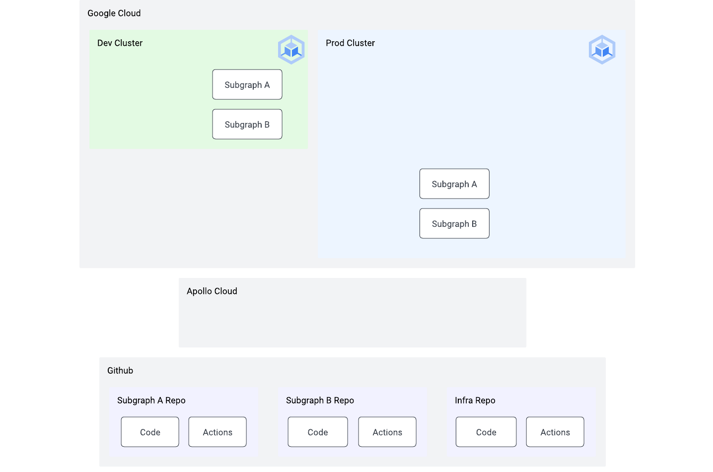

# 01 - Setup

⏱ estimated time: 45 minutes (TODO verify)

## What you'll build



## Part A: Gather accounts and credentials

### Clone this repo

```
git clone https://github.com/apollosolutions/build-a-supergraph.git
cd build-a-supergraph
```

### Install dependencies

- [GCloud CLI](https://cloud.google.com/sdk/docs/install)
- [Terraform](https://learn.hashicorp.com/tutorials/terraform/install-cli)
- [kubectl](https://kubernetes.io/docs/tasks/tools/)
- [kubectx](https://github.com/ahmetb/kubectx#installation)
- [Github CLI](https://cli.github.com/)
- Optional: [Helm](https://helm.sh/docs/intro/install/)

### Gather accounts

- [Github](https://github.com/signup)
- [Apollo Studio](https://studio.apollographql.com/signup?referrer=build-a-supergraph)
- [Google Cloud](https://console.cloud.google.com/freetrial)
  - Must have a project [with billing enabled](https://cloud.google.com/resource-manager/docs/creating-managing-projects#gcloud)

### Gather credentials

- [Github personal access token](https://docs.github.com/en/authentication/keeping-your-account-and-data-secure/creating-a-personal-access-token)
  - [Settings > Developer Settings > Personal Access Tokens](https://github.com/settings/tokens)
  - Grant it permissions to the following scopes:
    - `repo` (for creating repos)
    - `delete-repo` (for cleanup at the end)
- [Apollo Studio graph](https://www.apollographql.com/docs/studio/org/graphs#creating-a-graph)
  - [Apollo Studio key](https://www.apollographql.com/docs/studio/api-keys#graph-api-keys)

```sh
export PROJECT_ID="<your-project-id>"

gcloud components update
gcloud components install gke-gcloud-auth-plugin
gcloud auth application-default login
# expected output:
# > Credentials saved to file: [/Users/you/.config/gcloud/application_default_credentials.json]

gcloud config set project ${PROJECT_ID}
gcloud services enable \
  container.googleapis.com \
  secretmanager.googleapis.com \
  cloudasset.googleapis.com \
  storage.googleapis.com

gh auth login
```

### Setup terraform variables

Copy `terraform.sample_tfvars` to `terraform.tfvars` within the `01-setup` folder and replace the values below appropriately:

```terraform
github_token    = ""
github_username = ""
github_email    = ""
project_id      = ""
project_region  = "us-east1"
apollo_key      = ""
```

## Part B: Provision resources

### Create Kubernetes clusters, basic infrastructure, and Github repositories

**Note: The following commands will create resources on your GCP account, and begin to accrue a cost.** The example infrastructure defaults to a lower-cost environment (small node count and instance size), however it will not be covered by GCP's free tier.

Once you have populated your `terraform.tfvars` file, run the following commands:

```sh
cd 01-setup
terraform init # 2 minutes
terraform plan
terraform apply # will prompt for confirmation
# takes about 10-20 minutes- grab a cup of coffee while it runs
# TODO: confirm time to run after infra finalized
```

<details>
  <summary>What does this do?</summary>

- `terraform init`: Installs the required module dependencies for creating the Google Kubernetes Engine (GKE) clusters and networking
- `terraform plan`: Shows the planned infrastructure that's going to be created when running the next command, as well as showing any errors before applying
- `terraform apply`: Applies the planned infrastructure against your GCP account

</details>

Outputs:

1. `terraform` output:

   ```
   Outputs:

   kubernetes_cluster_names = {
     "dev" = "apollo-supergraph-k8s-dev"
     "prod" = "apollo-supergraph-k8s-prod"
     "tooling-infra" = "apollo-supergraph-k8s-tooling-infra"
   }
   ```

2. `01-setup/github-deploy-key.json`. **Do not check this into version control.** You will use this file in Part C to deploy subgraph services.

### Run cluster setup script

After creating the necessary clusters, you will need to run the included cluster setup script:

```sh
./setup_clusters.sh
```

<details>
  <summary>What does this do?</summary>

For both `dev` and `prod` clusters:

- Configures your local `kubeconfig` with access information, making it easier to apply local Helm charts
- Creates a `router` namespace we'll use to deploy the Apollo Router
- Creates a Kubernetes service account (`secrets-csi-k8s`) used for secrets access
- Installs the [GCP CSI Driver for Kubernetes](https://github.com/GoogleCloudPlatform/secrets-store-csi-driver-provider-gcp)
  - The CSI driver is used by the Apollo Router infrastructure later to access the Apollo API key and graph reference securely, using GCP's Secret Manager
- Configures permissions to allow access to the secrets within Secret Manager

</details>

After completing, you should be able to run:

```sh
kubectx apollo-supergraph-k8s-dev
kubectl get pods -A
```

Which returns all running pods.

## Part C: Deploy applications

### Deploy subgraphs

Terraform created two repos for your subgraphs (and a third repo for infrastructure). After creating the repos:

- Terraform automatically added a repository secret called `GCP_CREDENTIALS` in each repo.
- The initial commit kicked off the "docker-build" actions to build Docker images for deployment.

To deploy the images to your clusters:

```sh
gh workflow run deploy-gke --repo $GITHUB_ORG/apollo-supergraph-k8s-subgraph-a \
  -f version=main \
  -f cluster=apollo-supergraph-k8s-dev \
  -f publish=false \
  -f variant=dev \
  -f dry-run=false \
  -f debug=false

gh workflow run deploy-gke --repo $GITHUB_ORG/apollo-supergraph-k8s-subgraph-a \
  -f version=main \
  -f cluster=apollo-supergraph-k8s-prod \
  -f publish=false \
  -f variant=prod \
  -f dry-run=false \
  -f debug=false

gh workflow run deploy-gke --repo $GITHUB_ORG/apollo-supergraph-k8s-subgraph-b \
  -f version=main \
  -f cluster=apollo-supergraph-k8s-dev \
  -f publish=false \
  -f variant=dev \
  -f dry-run=false \
  -f debug=false

gh workflow run deploy-gke --repo $GITHUB_ORG/apollo-supergraph-k8s-subgraph-b \
  -f version=main \
  -f cluster=apollo-supergraph-k8s-prod \
  -f publish=false \
  -f variant=prod \
  -f dry-run=false \
  -f debug=false
```

To access a subgraph directly, use `kubectl port-forward`:

```sh
kubectx apollo-supergraph-k8s-dev
kubectl port-forward service/subgraph-a-chart 4000:4000
open http://localhost:4000
```

<details>
  <summary>Optional: how do I specify a different cluster prefix?</summary>

1.  Before running `terraform apply`, add another variable to `terraform.tfvars`:

    ```terraform
    demo_name = "my-custom-prefix"
    ```

2.  Before running `setup_clusters.sh`, export the prefix as a variable:

    ```sh
    export CLUSTER_PREFIX=my-custom-prefix
    ./setup_clusters.sh
    ```

3.  After creating the repos for subgraphs and infra, you'll need to update cluster names in workflows files in `.github/workflows` in each repo.

    ```yaml
    # .github/workflows/gke-deploy.yaml
    on:
      workflow_dispatch:
        inputs:
          clusters:
            options:
              - my-custom-prefix-dev
              - my-custom-prefix-prod
    ```

</details>
