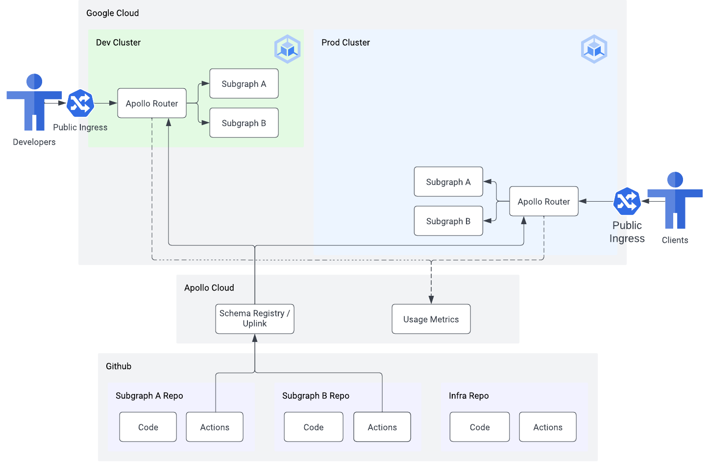

# 02 - Managed federation

⏱ estimated time: TODO

## What you'll build



## Part A: Apollo Studio

### Create a graph

- Log in to Studio
- Click "Create Graph"
- Give it a name
- Record graph ID and API key

```sh
export APOLLO_GRAPH_ID=<graph id>
export APOLLO_KEY=<api key>
```

## Part B: Publishing subgraphs

- TODO: add graph id and api key as github secrets in subgraph-a, subgraph-b
- TODO: add schema publish step to deploy workflows in subgraph-a, subgraph-b
- TODO: manually trigger deploy workflows
- TODO: observe supergraph in studio

## Part C: Deploy Apollo Router

- TODO: add api key to Google Secrets Manager
- TODO: add graphref to infra repo
- TODO: manually trigger deploy workflow in infra repo (deploys both router and ingress)
- TODO: test operations against the router using explorer
