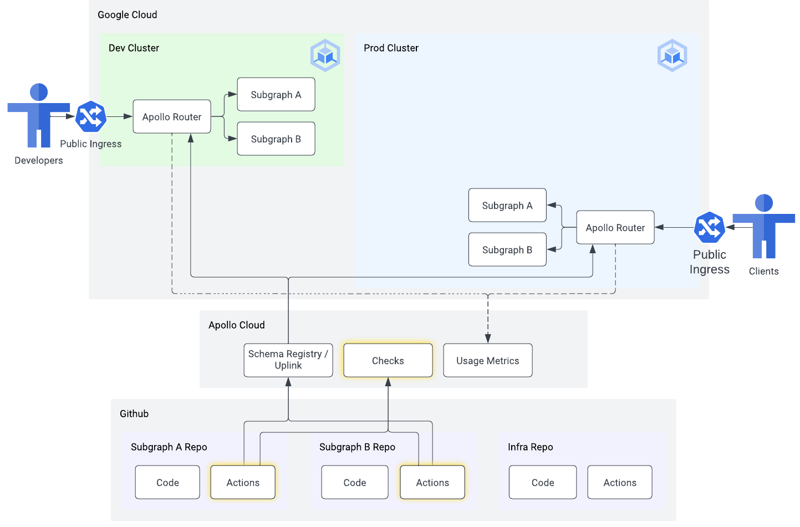

# 03 - Schema checks

⏱ estimated time: TODO

## What you'll build

## Part A: Schema checks on pull requests

- TODO: add new workflow to subgraph repos with check steps

## Part B: Demonstrate a schema change

- TODO: instructions for:
  - making a schema change in a subgraph
  - open a PR
  - see check results
  - merge PR
  - see results in dev
  - trigger prod deploy
