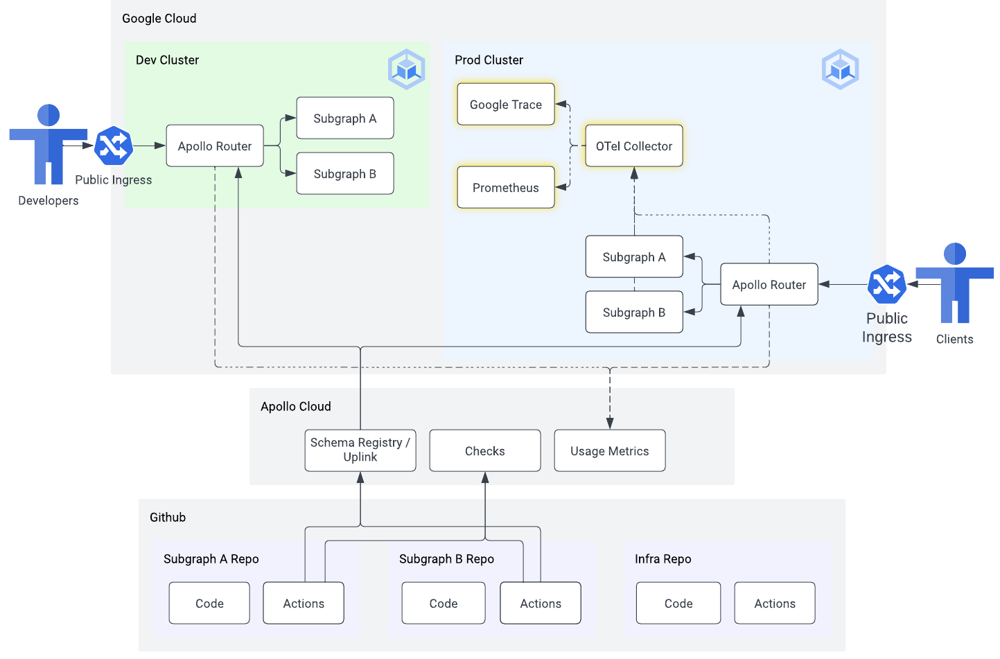

# 04 - Observability

⏱ estimated time: TODO

## What you'll build

## Part A: Setup Open Telemetry

- TODO: manifests to add to infra repo for
  - OTel collector
  - Prometheus
  - Zipkin

## Part B: Demonstrate traces and metrics

- TODO: instructions for seeing traces and metrics
