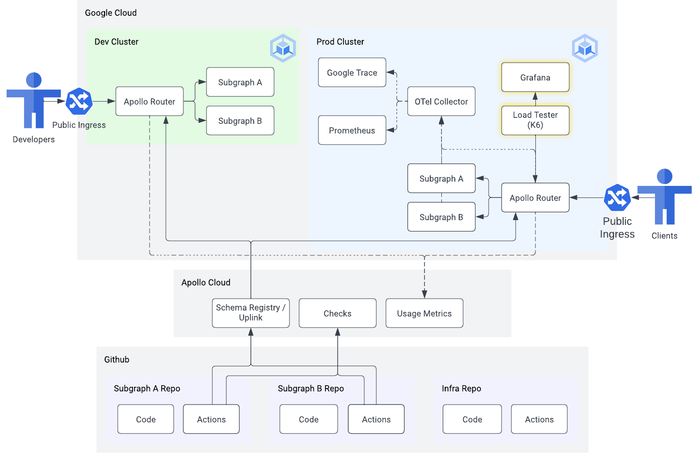

# 05 - Load testing and cleanup

⏱ estimated time: TODO

## What you'll build



## Part A: Deploy load testing client

- TODO: manifests for load testing client in infra repo

## Part B: Run load test and analyze results

- TODO: instructions for running a load test and seeing results

## Part C: Cleanup

```sh
terraform destroy
# takes 10 minutes

kubectl config delete-context supergraph-dev
kubectl config delete-context supergraph-prod
kubectl config delete-user gke_${PROJECT_ID}_us-east1_apollo-supergraph-k8s-dev
kubectl config delete-user gke_${PROJECT_ID}_us-east1_apollo-supergraph-k8s-prod
kubectl config delete-cluster gke_${PROJECT_ID}_us-east1_apollo-supergraph-k8s-dev
kubectl config delete-cluster gke_${PROJECT_ID}_us-east1_apollo-supergraph-k8s-prod
```
